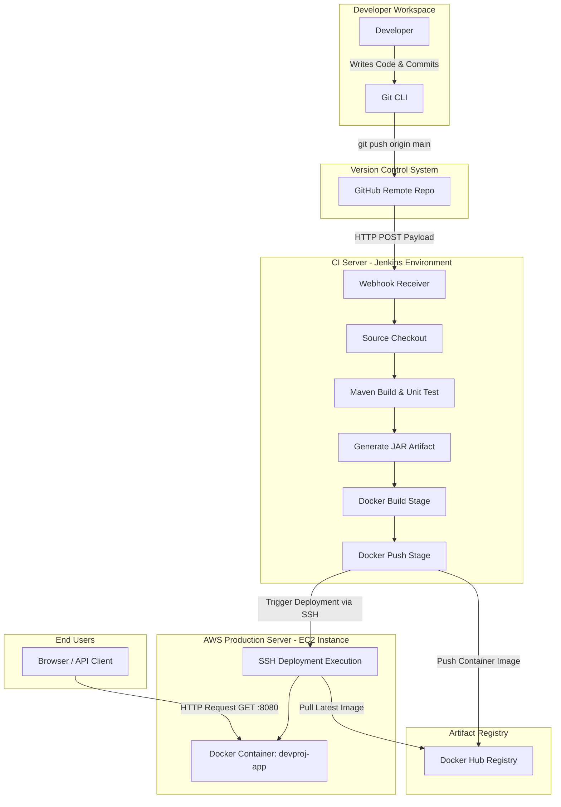
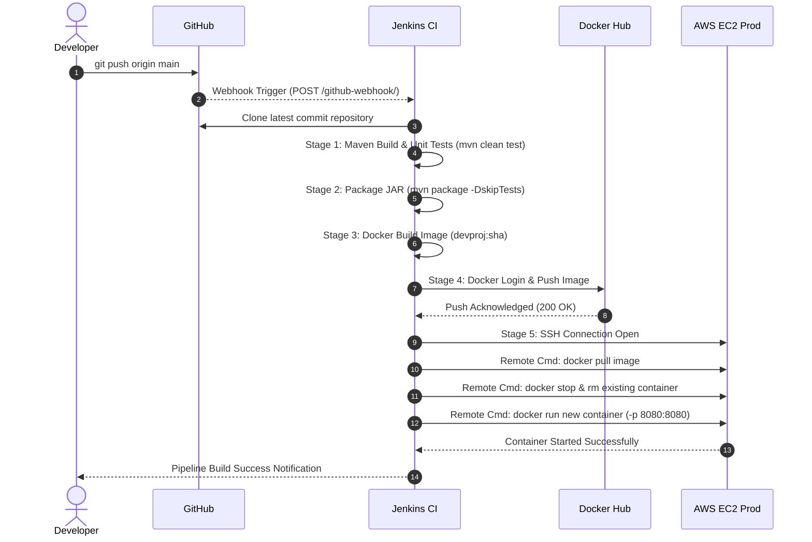

# Comprehensive DevOps Architecture & System Design Document

---

## Executive Summary
This document serves as the foundational engineering architecture and blueprint for building an automated End-to-End CI/CD deployment pipeline for a production-style Java Spring Boot application. Designed following modern DevOps principles, this architecture enforces Zero Manual Deployment while adhering to strict resource constraints (AWS Free Tier).

---

## 1. Project Vision
To establish a fully automated, resilient, and reproducible software delivery lifecycle (SDLD) that transforms raw Java source code into a deployed, containerized application in cloud infrastructure upon code push, eliminating human error and manual intervention.

---

## 2. Problem Statement
In traditional software development lifecycle operations, software deployment is heavily reliant on manual processes:
- Developers manually build JAR/WAR packages on local environments ("It works on my machine" syndrome).
- Developers or SysAdmins manually SCP/FTP artifacts into target remote servers.
- Manual SSH sessions are established to run restart scripts, manage dependencies, and handle environmental variables.

**Risks of Traditional Approach:**
1. **High Error Rate:** Human mistakes during manual commands or configuration deployment.
2. **Environment Drift:** Discrepancy between developer machines, staging, and production environments.
3. **Downtime & Slow Velocity:** Deployments take hours or days instead of minutes, stalling business value delivery.
4. **Lack of Auditability:** No single source of truth for what commit version is currently running in production.

---

## 3. Business Goal
- **Accelerate Time-to-Market (TTM):** Reduce deployment cycle duration from days/hours to minutes.
- **Ensure High Quality:** Enforce automated unit and integration tests before code reaches staging/production.
- **Zero-Touch Deployments:** Enable continuous deployment triggered directly by developer git commits (`git push`).
- **Cost Efficiency:** Operate entirely within AWS Free Tier infrastructure without sacrificing security or baseline stability.

---

## 4. Learning Goal
Master first-principles DevOps methodology, understanding not just *how* to write scripts or pipeline stages, but *why* specific architectural decisions are made:
- Understand containerization vs virtual machines.
- Master CI orchestration with Jenkins pipelines.
- Understand cloud instance isolation, security groups, and SSH automation.
- Acquire real-world troubleshooting skills for pipeline failures, container lifecycles, and networking constraints.

---

## 5. Functional Requirements
1. **Automated Triggering:** Pipeline automatically triggers upon a `git push` event to the repository's `main` branch via GitHub Webhooks.
2. **Automated Compilation & Test Execution:** Maven builds the Java application and executes all unit tests; builds fail immediately if tests fail.
3. **Artifact Packaging:** Maven produces a standalone, runnable JAR file.
4. **Container Image Creation:** Docker builds a minimal, multi-stage lightweight image containing the compiled application.
5. **Registry Management:** Docker images are tagged (semantic versioning & commit SHA) and pushed to Docker Hub.
6. **Remote Deployment:** Jenkins securely connects to an AWS EC2 instance via SSH, pulls the latest image, stops/removes the previous container, and launches the updated container with proper port bindings.
7. **Application Availability:** The Spring Boot web application is accessible over HTTP on port 80/8080.

---

## 6. Non-Functional Requirements
1. **Idempotency:** Re-running the pipeline for the same commit produces the exact same state without crashing target servers.
2. **Lightweight Footprint:** Entire architecture runs within a single AWS EC2 `t2.micro` or `t3.micro` instance (1 vCPU, 1 GB RAM).
3. **Security:** Zero plaintext credentials in source code. All tokens, SSH keys, and Docker passwords stored in Jenkins Credentials Manager.
4. **Maintainability:** Declarative pipeline syntax (`Jenkinsfile`) versioned inside the GitHub repository alongside application code.
5. **Observability:** Detailed pipeline logs with status notifications for build success or failure.

---

## 7. Scope

### In-Scope (Version 1)
- Java 21 / Spring Boot application with Maven.
- GitHub repository hosting application code and infrastructure configs.
- Self-hosted / EC2 Jenkins instance configured with Docker and Java.
- Docker containerization of the Spring Boot application.
- Public/Private Docker Hub repository management.
- AWS EC2 Ubuntu instance hosting the production container.
- Automated deployment script executed via SSH.

### Out-of-Scope (Version 1)
- Kubernetes / Helm / ArgoCD (Reserved for Future Version).
- Terraform / Ansible Infrastructure-as-Code (Reserved for Future Version).
- Multi-region AWS deployments / Load Balancers (ALB) / Auto Scaling Groups.
- External managed databases (AWS RDS).
- Comprehensive monitoring stacks (Prometheus / Grafana).

---

## 8. Assumptions
- Developer has access to an AWS account (Free Tier eligible).
- Developer uses standard Git workflows.
- Application does not require high-throughput multi-gigabyte state storage initially.
- Deployment environment uses standard Linux (Ubuntu 22.04 LTS).

---

## 9. Risks & Mitigations

| Risk | Impact | Likelihood | Mitigation Strategy |
| :--- | :--- | :--- | :--- |
| **EC2 Out of Memory (OOM)** | High | High (1 GB RAM limit) | Configure Swap space on EC2, set JVM memory limits (`-Xmx256m -Xms128m`), and limit Docker container memory usage. |
| **Exceeding AWS Free Tier** | Medium | Medium | Strict exclusion of ALB, NAT Gateways, EKS, RDS. Single EC2 `t2.micro` instance with 30GB EBS volume. |
| **Jenkins Build Stalls / Slowness** | Medium | Medium | Use Maven dependency caching, lightweight base Docker images (`eclipse-temurin:21-jre-alpine`), clean up dangling images automatically. |
| **Security Leakage of SSH Keys** | Critical | Low | Pass secrets via Jenkins Credential Store; never hardcode credentials in `Jenkinsfile` or repository. |

---

## 10. Constraints
- **Cloud Provider:** AWS Free Tier (`t2.micro` / `t3.micro`: 1 vCPU, 1 GB RAM, 30 GB EBS).
- **Zero Cost Strategy:** Absolutely no managed services that incur hourly costs (e.g., NAT Gateways, Elastic Load Balancers, ECS/EKS clusters).
- **Minimal Dependencies:** Standard Unix utility scripts (`bash`, `ssh`, `docker CLI`) for deployment steps.

---

## 11. Success Criteria
1. Developer executes `git push origin main`.
2. Within 3 minutes, Jenkins automatically triggers, compiles, tests, packages, containerizes, pushes to Docker Hub, and deploys to AWS EC2.
3. Accessing `http://<EC2-PUBLIC-IP>:8080/health` returns HTTP 200 OK with the updated application response.
4. No human intervention required between `git push` and live site verification.

---

## 12. Technology Justification & Trade-off Analysis

### 12.1 Programming Language & Framework: Java + Spring Boot + Maven

- **What:** Industry standard enterprise Java framework and dependency management tool.
- **Why:** Java Spring Boot provides an embedded Tomcat server, production-ready REST end-points, and reliable build lifecycles via Maven.
- **Advantages:** Strong typing, huge ecosystem, enterprise adoption, standardized directory structures.
- **Disadvantages:** Higher baseline memory footprint compared to Go or Rust.
- **Alternatives Considered:** Node.js (Express), Python (FastAPI), Go.
- **Reason for Rejection:** The primary objective is mastering enterprise DevOps for Java workflows; Java remains the most heavily deployed language in enterprise IT.
- **Industry Usage:** Financial institutions, e-commerce giants (Amazon, Netflix, Uber).

### 12.2 Version Control: Git + GitHub

- **What:** Distributed version control system and cloud platform for hosting Git repositories.
- **Why:** Provides webhook integration triggers, pull request code reviews, and centralized artifact version tracking.
- **Advantages:** Universal industry standard, native webhook support with Jenkins.
- **Disadvantages:** Public repository code visibility if credentials aren't managed properly (mitigated by `.gitignore` & secret scanning).
- **Alternatives Considered:** GitLab, Bitbucket.
- **Reason for Rejection:** GitHub is the most widely adopted platform with seamless free integrations.

### 12.3 CI Automation Server: Jenkins

- **What:** Open-source automation server supporting custom build/deploy pipelines.
- **Why:** Full control over pipeline execution, zero cost, massive plugin ecosystem, declarative `Jenkinsfile` standard.
- **Advantages:** Self-hosted (Free), highly customizable, supports credentials management and Docker agent nodes natively.
- **Disadvantages:** Requires manual setup and maintenance compared to SaaS CI solutions.
- **Alternatives Considered:** GitHub Actions, GitLab CI, CircleCI.
- **Reason for Rejection:** GitHub Actions abstracts server management. Learning self-hosted Jenkins provides deep insights into CI server internals, agent management, and server administration required in enterprise roles.

### 12.4 Containerization: Docker & Docker Hub

- **What:** Software platform for building, running, and managing isolated application containers.
- **Why:** Solves the "works on my machine" problem by bundling application code, JDK runtime, OS libraries, and configurations into an immutable image.
- **Advantages:** Portability, predictable environment across Dev/Test/Prod, fast boot times.
- **Disadvantages:** Container image size overhead if not optimized (mitigated by Alpine JRE base images).
- **Alternatives Considered:** Direct JAR execution via `systemd` service on EC2.
- **Reason for Rejection:** Direct JAR execution leads to dependency drift, manual JDK installation on servers, and dirty upgrades.
- **Industry Usage:** Core building block of modern cloud-native software architecture.

### 12.5 Cloud Infrastructure & Operating System: AWS EC2 (Ubuntu 22.04 LTS)

- **What:** Amazon Elastic Compute Cloud offering resizable virtual compute instances running Linux.
- **Why:** Provides raw compute access inside AWS Free Tier to install Docker and host our application container.
- **Advantages:** Full root SSH access, Security Group firewall control, Free Tier eligible.
- **Disadvantages:** Single point of failure if instance crashes (acceptable for V1 scope).
- **Alternatives Considered:** AWS Elastic Beanstalk, AWS ECS.
- **Reason for Rejection:** Elastic Beanstalk and ECS abstract the underlying server operations. Manual orchestration over EC2 builds fundamental SysAdmin and DevOps expertise.

---

## 13. High-Level Architecture

```
+------------------+         +-------------------+         +---------------------+
|                  |         |                   |         |                     |
|  Developer Laptop|  Push   |  GitHub           | Webhook |  Jenkins CI Server  |
|  (Git / Code)    +-------->+  (Repository)     +-------->+  (EC2 / Linux)      |
|                  |         |                   |         |                     |
+------------------+         +-------------------+         +----------+----------+
                                                                      |
                                                                      | 1. Maven Build
                                                                      | 2. Run Unit Tests
                                                                      | 3. Docker Build
                                                                      v
+------------------+         +-------------------+         +----------+----------+
|                  |         |                   |         |                     |
|  AWS EC2 Prod    |  Pull   |  Docker Hub       |  Push   |  Docker Image       |
|  Container Engine| <-------+  Image Registry   | <-------+  (app:v1.0.0-sha)  |
|  (App Running)   |  Image  |                   |  Image  |                     |
+------------------+         +-------------------+         +---------------------+
```

---

## 14. Low-Level Architecture & Component Interaction

1. **Trigger:** Developer runs `git push origin main`.
2. **Webhook Event:** GitHub sends a HTTP POST payload to Jenkins URL `http://<JENKINS_IP>:8080/github-webhook/`.
3. **Pipeline Initialization:** Jenkins wakes up, checks out the specific git commit.
4. **Compilation & Test:** Jenkins executes `mvn clean test package` inside a workspace.
5. **Image Build:** Jenkins executes `docker build -t <username>/devproj:latest -t <username>/devproj:<commit-sha> .`.
6. **Registry Push:** Jenkins authenticates with Docker Hub and pushes both tags.
7. **SSH Handshake:** Jenkins opens an encrypted SSH session to AWS EC2 Production instance using stored private SSH key.
8. **Deployment Commands Executed on EC2 Remote:**
   - `docker login` (if private registry)
   - `docker pull <username>/devproj:latest`
   - `docker stop devproj-app || true`
   - `docker rm devproj-app || true`
   - `docker run -d --name devproj-app --restart unless-stopped -p 8080:8080 <username>/devproj:latest`
   - `docker image prune -f` (clean unused old images to save disk space).
9. **Verification:** Application is live at `http://<EC2_IP>:8080/`.

---

## 15. Component Diagram



---

## 16. Deployment Diagram

```mermaid
deploymentDiagram
    node "Developer Machine" {
        artifact "Source Code (Java, Pom.xml, Dockerfile, Jenkinsfile)" as SourceCode
    }

    node "GitHub Platform" {
        component "GitHub Repo: project-jugaad" as GHRepo
    }

    node "AWS Cloud (Free Tier VPC)" {
        node "EC2 Instance: CI Server (Ubuntu 22.04)" {
            component "Jenkins Service (:8080)" as Jenkins
            component "Local Docker Engine" as JenkinsDocker
        }

        node "EC2 Instance: Prod Server (Ubuntu 22.04)" {
            component "Docker Daemon" as ProdDocker
            component "Container: Spring Boot App (:8080)" as AppContainer
            database "EBS Volume (30GB)" as Storage
        }

        ProdDocker --- Storage
    }

    node "Docker Cloud" {
        component "Docker Hub Registry" as Registry
    }

    SourceCode --> GHRepo : git push
    GHRepo --> Jenkins : Webhook
    Jenkins --> JenkinsDocker : Builds Image
    JenkinsDocker --> Registry : Push Image
    Jenkins --> ProdDocker : SSH Remote Commands
    ProdDocker --> Registry : Pull Image
    ProdDocker --> AppContainer : Run Container
```

---

## 17. CI/CD Flow Diagram



---

## 18. Network Flow & Security Group Configuration

### AWS Security Group Requirements

#### 1. Jenkins Instance Security Group (`sg-jenkins`)
| Protocol | Port Range | Source | Purpose |
| :--- | :--- | :--- | :--- |
| TCP | 22 | Developer IP / Admin IP | SSH Management Access |
| TCP | 8080 | 0.0.0.0/0 (or GitHub Webhook IPs) | Jenkins Web Dashboard & Webhook Receiver |

#### 2. Production EC2 Instance Security Group (`sg-production`)
| Protocol | Port Range | Source | Purpose |
| :--- | :--- | :--- | :--- |
| TCP | 22 | Jenkins Server Elastic/Public IP | Secure Remote SSH Deployment Execution |
| TCP | 8080 (or 80) | 0.0.0.0/0 | Public HTTP Traffic to Java Application |

---

## 19. Professional Directory Structure

```
project-jugaad/
├── README.md                           # Master Project Overview & Quickstart
├── LICENSE                             # Open-source License (MIT)
├── .gitignore                          # Excluded files (target/, .idea/, credentials)
├── docs/                               # Engineering Documentation
│   ├── architecture/
│   │   └── design-spec.md              # Complete Architecture & System Design
│   ├── diagrams/                       # Diagram assets & visual exports
│   └── screenshots/                    # Verification evidence screenshots
├── application/                        # Java Spring Boot Source Code
│   ├── pom.xml                         # Maven project object model & dependencies
│   └── src/
│       ├── main/
│       │   ├── java/
│       │   │   └── com/jugaad/devops/
│       │   │       ├── DevopsApplication.java
│       │   │       └── controller/
│       │   │           └── HealthController.java
│       │   └── resources/
│       │       └── application.yml     # Application properties configuration
│       └── test/
│           └── java/
│               └── com/jugaad/devops/
│                   └── DevopsApplicationTests.java
├── docker/                             # Dockerization Assets
│   ├── Dockerfile                      # Multi-stage Docker build configuration
│   └── .dockerignore                   # Docker build context exclusions
├── jenkins/                            # Continuous Integration Assets
│   └── Jenkinsfile                     # Declarative Pipeline configuration script
└── scripts/                            # Operational & Deployment Automation Scripts
    ├── deploy.sh                       # Target server SSH deployment script
    └── setup-ec2.sh                    # EC2 bootstrap script (Docker & Linux setup)
```

---

## 20. Development Roadmap (Phases 1 to 15)

- **Phase 1: Requirement Analysis & Design Specification** (Completed)
- **Phase 2: Project Scope & Architectural Freeze** (Completed)
- **Phase 3: Directory Blueprint Setup** (Current)
- **Phase 4: Technology Deep-Dive & Justifications** (Completed)
- **Phase 5: Java Spring Boot Base Application Development**
- **Phase 6: Maven Build & Unit Test Verification**
- **Phase 7: Cloud Infrastructure Provisioning (AWS EC2 & Linux Swap Setup)**
- **Phase 8: Dockerization (Multi-stage Dockerfile Optimization)**
- **Phase 9: Docker Hub Registry Integration**
- **Phase 10: Jenkins Server Installation & Plugin Configuration**
- **Phase 11: Declarative Jenkins Pipeline Creation (`Jenkinsfile`)**
- **Phase 12: Automated Deployment Automation Scripting (`deploy.sh`)**
- **Phase 13: End-to-End Pipeline Verification & Troubleshooting**
- **Phase 14: Documentation Finalization & Open Source Preparation**
- **Phase 15: Production Hardening (Swap space, memory limits, prune strategy)**

---

## 21. Sprint Planning

### Sprint 1: Architecture & Foundation Setup (Phases 1 - 6)
- **Deliverables:** Architecture doc, directory structure, Spring Boot application with REST endpoint, local Maven build & tests green.

### Sprint 2: Infrastructure & Containerization (Phases 7 - 9)
- **Deliverables:** Provisioned AWS EC2 instances, Docker setup, multi-stage `Dockerfile` created, Docker Hub image build verified.

### Sprint 3: CI/CD Pipeline Automation (Phases 10 - 13)
- **Deliverables:** Jenkins operational, credentials securely stored, `Jenkinsfile` executing full pipeline upon `git push`, live application deployment verified.

### Sprint 4: Hardening & Documentation (Phases 14 - 15)
- **Deliverables:** Full execution verification, README finalization, troubleshooting guide, interview talking points document.

---

## 22. Deliverables Checklist
- [x] Comprehensive Architecture & Design Specification (`docs/architecture/design-spec.md`)
- [x] Standard GitHub Repository Structure
- [ ] Working Java Spring Boot Application (`application/`)
- [ ] Optimized Multi-stage `Dockerfile` (`docker/Dockerfile`)
- [ ] Robust Shell Deployment Script (`scripts/deploy.sh`)
- [ ] Production-Ready Declarative `Jenkinsfile` (`jenkins/Jenkinsfile`)
- [ ] Verified Zero-Touch Deployment Pipeline on AWS EC2
- [ ] Complete Technical Interview Readiness Guide

---

## 23. Future Enhancements (Post-V1 Roadmap)
1. **Infrastructure as Code (IaC):** Provision AWS EC2 instances using HashiCorp Terraform instead of manual AWS Console creation.
2. **Configuration Management:** Use Ansible playbooks for automated server bootstrapping and Docker installation.
3. **Orchestration Upgrade:** Migrate single EC2 Docker container deployment to Kubernetes (Minikube / k3s / EKS) using Helm charts.
4. **Observability Stack:** Integrate Prometheus and Grafana for metrics monitoring and Loki for log aggregation.
5. **GitOps Implementation:** Transition from Jenkins SSH deployment to ArgoCD pulled directly from Git.
